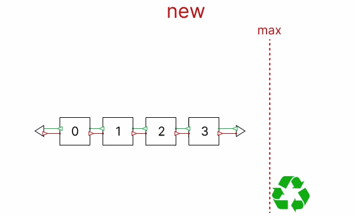

[English version](README.md)

# memcache
memcache - это крохотный кэш с поддержкой функционала шардирования, LRU и TTL. Кэш используется как сторонняя библиотека напрямую в коде Go

### Lock contention

### LRU

### TTL